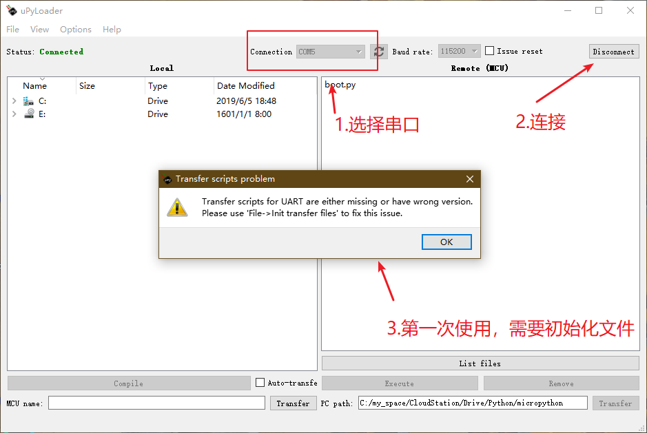

# NODE_MCU_EXTEND
node mcu V 1.1 扩展版

## 1.整体介绍

NODE_MCU_EXTEND扩展板 是基于 [NODE_MCU](http://www.nodemcu.com/index_cn.html)基于ESP32开发的一款测试开发板，
其效果如下图所示
)

原理图

包含了4个KEY，1个touchKEY，一个OLED1.3（SSD1306 or SH1106）,一个TF卡和一个震动马达组成。

> PIN 分配图

组件 | PIN |  备注  
-|-|-
OLED12864 | - | - 
~ | GPIO14 | SPI_CLK 
 -| GPIO13| SPI_MOSI
  -| -|MISO可以不接 
-| GPIO26|RESET 
-| GPIO27|DC 
-| GPIO5|CS 
TF_CARD | - | - 
 -| GPIO6 | CLK
  -| GPIO11 |CMD/DI0
-| GPIO8|DAT1 
-| GPIO9|DAT2 
-| GPIO10|DAT3 
key | - | - 
 -| GPIO15 | KEY1
  -| GPIO4 |KEY2
-| GPIO16|KEY3 
-| GPIO17|KEY4 
-| GPIO32|touchkey 
motor | - | - 
 -| GPIO12 | 使用PWM驱动 频率在 1HZ-10HZ

 ## 2.测试

 本板使用  [esp-wroom-32](https://www.espressif.com/zh-hans/products/hardware/esp-wroom-32/overview)作为核心控制元件,[micropython](http://www.micropython.org/)为主要编程语言

 其中 ESP32 资料[下载地址](https://www.espressif.com/zh-hans/support/download/documents?keys=ESP32),

esp32 micropython [固件地址](http://www.micropython.org/download)

### 2.1 刷micropython 固件

首先需要安装esptool
> pip install esptool

然后确认COM口

进行擦除FLASH，烧录固件

> esptool.py --chip esp32 --port COM5 erase_flash

> esptool.py --chip esp32 --port COM5 --baud 460800 write_flash -z 0x1000 esp32-20190605-v1.11-37-g62f004ba4.bin

### 2.2 使用 uPyLoader 同步程序

[uPyLoader](https://github.com/BetaRavener/uPyLoader) 是基于串口的同步软件

## 3.参考
参考地址  |  备注  
-|-
[MicroPython入坑记（二）刷固件（ESP8266 ESP32）](https://www.cnblogs.com/yafengabc/p/8681380.html) | 刷micropython固件参考 
[micropython](https://github.com/micropython/micropython) | micropython官方地址
[esp32 micropython](http://docs.micropython.org/en/latest/esp32/general.html) | esp32 micropython使用API
[SH1106](https://github.com/robert-hh/SH1106) | SH1106 micropython 固件

