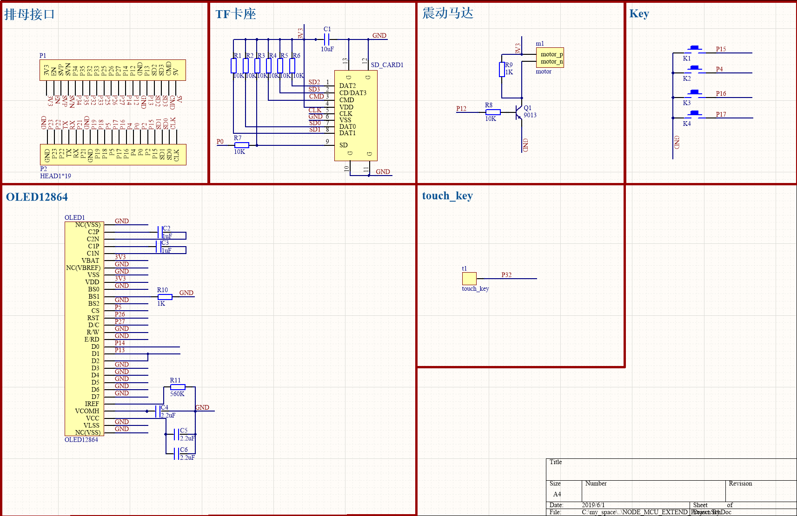

# NODE_MCU_EXTEND
node mcu V 1.1 扩展版

## 1.整体介绍

NODE_MCU_EXTEND扩展板 是基于 [NODE_MCU](http://www.nodemcu.com/index_cn.html)基于ESP32开发的一款开发板，
其效果如下图所示
)

原理图

包含了4个KEY，1个touchKEY，一个OLED1.3（SSD1306 or SH1106）,一个TF卡和一个震动马达组成。

> PIN 分配图

组件 | PIN |  备注  
-|-|-
OLED12864 | - | - |
- | GPIO14 | SPI_CLK |
 -| GPIO13| SPI_MOSI|
  -| -|MISO可以不接 |
-| GPIO26|RESET |
-| GPIO27|DC |
-| GPIO5|CS |
TF_CARD | - | - |
 -| GPIO6 | CLK|
  -| GPIO11 |CMD/DI0|
-| GPIO8|DAT1 |
-| GPIO9|DAT2 |
-| GPIO10|DAT3 |
key | - | - |
 -| GPIO15 | KEY1|
  -| GPIO14 |KEY2|
-| GPIO16|KEY3 |
-| GPIO17|KEY4 |
-| GPIO32|touchkey |
motor | - | - |
 -| GPIO12 | 使用PWM驱动 频率在 1HZ-10HZ|
